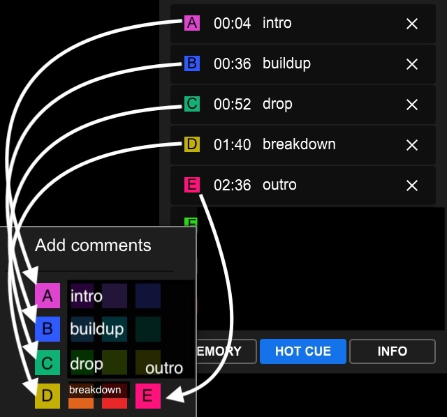

# audiovj-ai

Real-time DJ phrase detection for lighting/visual control.

## Goal

The goal of this project is to create a real-time DJ phrase detection system that can be used for lighting and visual control during live performances. No need for pre-processing of audio tracks or syncing, just supply an audio signal of the DJ's output.

## 🚧 Work In Progress

- Model architecture is very rough still.
- The performance isn't great yet.
- For tempo and phase detection, Ableton Link/[Carabiner](https://github.com/Deep-Symmetry/carabiner) is used in the meantime, until I can get the phrase detection working well enough. Then, I can focus on implementing another model to track tempo and phase.

## Pipeline

### 1. Label tracks in rekordbox

1. Create a playlist named "audiovj" and add tracks you want to use for training. The name of the playlist can be configured when importing, in step 2, but by default it is "audiovj"

2. For each song in the "audiovj" playlist,
   1. Make sure the beatgrid is accurate, including the downbeats.
   2. Use cue points to label the start of each phrase **using the color of the cue point**. In the screenshot below, I also renamed the cue points for clarity, but note the import script only uses the color.



3. Once done, export the library to an XML file (File > Export Collection in xml format).

4. Make sure the audio tracks are in a folder that you can point to when importing. If needed, they can also be copied to a new location. The exact folder structure does not matter, the import script will recursively search for audio files, and match them to the tracks in the XML file based on filename. _Tip: you can drag and drop tracks from rekordbox into your OS' file explorer to copy them to a new location (only tested on Mac)._

### 2. Import tracks from rekordbox

```bash
uv run audiovj import-rekordbox <path-to-library.xml> <path-to-audio-folder>
```

Only imports tracks in the "audiovj" playlist. Override with `--playlist <name>`.

### 3. Preprocess audio

```bash
uv run audiovj preprocess
```

### 4. Inspect a track

```bash
uv run audiovj inspect <track_id>
```

### 5. Train

```bash
uv run audiovj train [--epochs 50] [--batch-size 8] [--lr 1e-3]
```

### 6. Evaluate

```bash
uv run audiovj evaluate
```

### 7. Predict on a track

```bash
uv run audiovj predict-file <track_id>
```

### 8. Predict on live audio

```bash
uv run audiovj run-live --audio-device <index|name> --audio-channels <ch,ch>
```

#### List Devices

```bash
uv run audiovj list-devices
```
